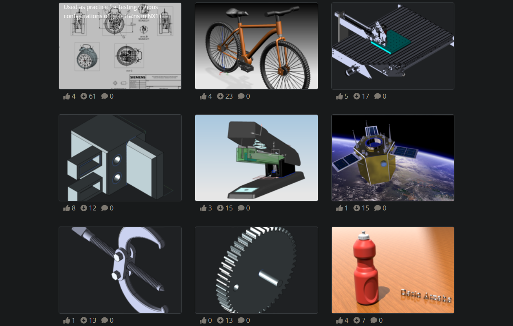

	

<h1 align="center">🌊 Welcome to my GitHub Profile🌴</h1>

 

Nice to meet you! 

I'm a mechatronics engineer that is passionate about everything related to the tech industry including robotics, machine learning, embedded systems, data analysis and cybersecurity. 

<!-- Hope you are having a great day. Let's collaborate and connect 🤝 -->

 
<h2 align="left">Connect With Me ☕</h2>

  
  
  
  
  
  
  
  
  

 

<h2 align="left">Languages and Tools 🚀</h2>

  
  
  
  
  
  
  
  
  
  
  
  
  
  
  
  
  
  
  
  

 

## Coding Activity 👨‍💻

 

## CAD and 3D Models 💻	

 

## Blog 📝

- [International Collegiate Programming Contest Problems](https://darioarzaba.vercel.app/blog/programming/ICPC1974)

 

---

 

<h3 align="center"></h3>

  You are the visitor number: 
   
  
   
   
  ⭐ Thank you ⭐ 

<!-- You are awesome! <3 -->
